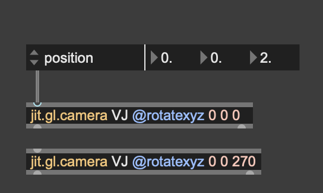
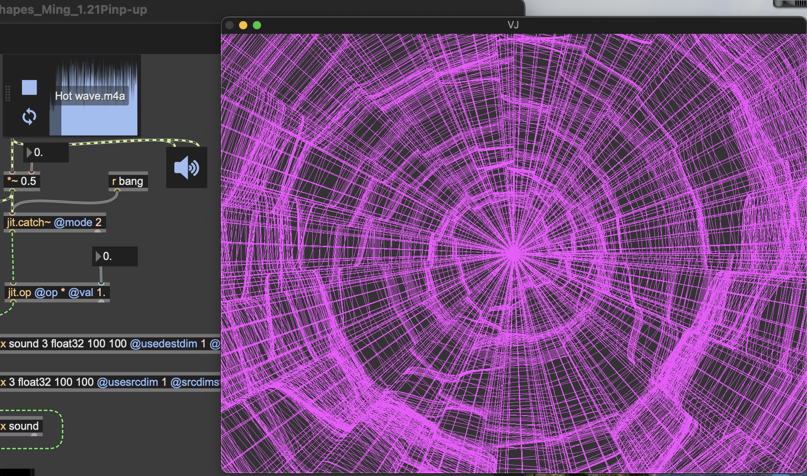
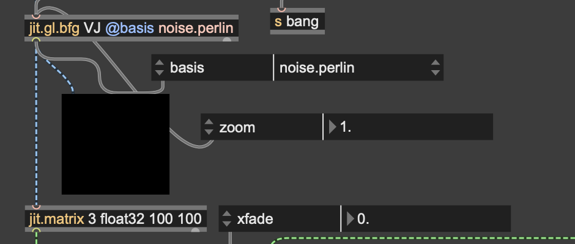

# Project Title
Hyakuren(百斂) - Hundred Convergences

## Short Description
An audio-reactive visual installation that explores the relationship between natural forms and digital sound. The project turns sound into a changing 3D visual form in real time.

## Concept
Hyakuren(百斂)is about turning sound into visual form. The music I chose has strong beats and a powerful feeling, so after watching some films and animations, I decided to use Berlin noise as the main visual style. By connecting real-time sound with generative rules, the visuals move and change with the music. The project explores how invisible sound can become something visible and alive, allowing the audience to experience music more physically.

## Technology Used
1. Berlin noise

This is the main algorithm of my system. I use Perlin Noise as a starting point. Compared to normal random values, it creates smoother data and helps the 3D shapes change in a more natural way.

You can also experiment with different nodes to create more visual variations.

2. Morphological Sculpting - hit.gl.nurbs

This is the final rendering stage of my project. I use NURBS instead of polygon meshes to get smoother surfaces. The shape is driven by noise and audio data, which allows it to change in real time and feel more fluid.

3. Dynamic Narrative - jitter.gl.camera

Besides the shape, I set up multiple camera views using jet.gl.camera. The view switches based on sound data or preset logic, allowing the audience to experience the space in different ways.

## How to run
1. Turn on the Toggle

Turn the toggle blue to open the visual display.

2. Click the Play button

Play the music to start the audio-reactive visuals.

3. Different visual effects

You can change the number to control different visual effects with music.